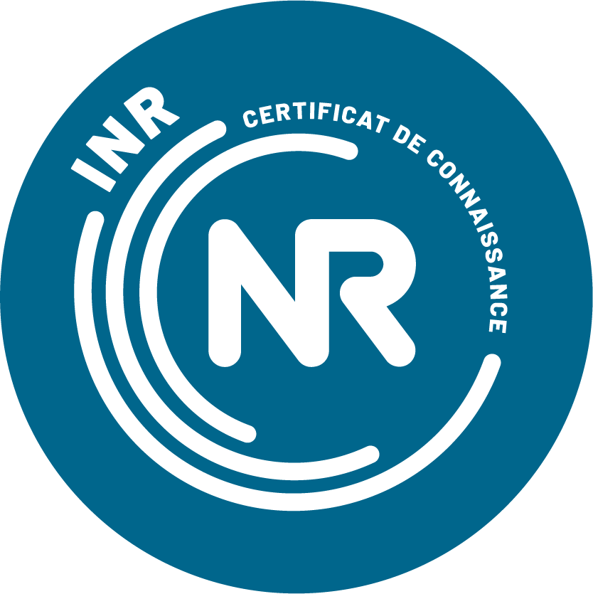

# **Edouard ETIENNE**

## About Me
A **Software tester** with a deep interest in **Environmental Science**

I’m currently building my portfolio while exploring the four pilars of **sustainable IT**:
- __Green IT__
- __IT for Green__
- __Human IT__
- __IT for Human__.

---

## Badges

---

## Let’s Connect!
I’m open to collaborations, feedback, and discussions about **software testing, environmental science or career growth**. Feel free to reach out!

- **LinkedIn:** [LinkedIn Profile](https://linkedin.com/in/edouardetienne)
- **GitHub:** [GitHub Profile](https://github.com/ehetienne)

---
